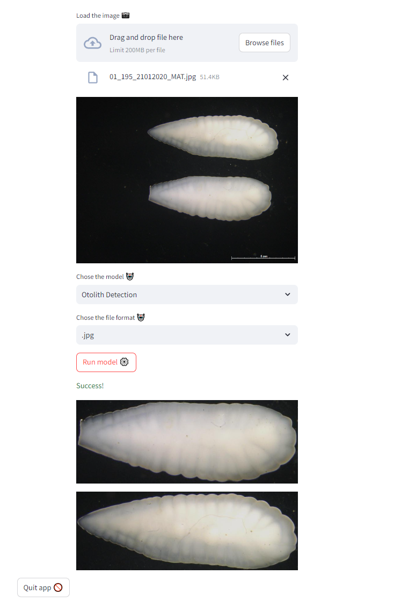

# Otolith detection
A simple project to learn how to make apps to server models.  
The aim is to utilize docker and several libs such as gradio or streamlit to make apps to serve an otolith detection model.  

## Description

Docker is still not working for now, but all dependencies are in the requirements.txt file.
After that is done simply  run either the `app_X.py` or `main.py` file to start. `main.py` is just a simple script that runs and support both single image and batch upload. `app_X.py` are a set of simple gradio / streamlit / etc apps. Gradio only supports single image inference, while streamlit will support batch upload.

## Weights

As of now, the weights are not included in the repo, as we are still writing a paper on this topic. You can download any of the YoLov8 weights provded by ultralitics and try to see if they work.

## Showcase

	
	
